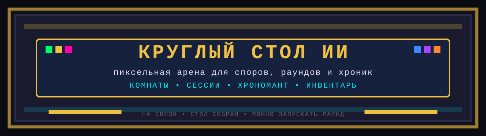

# ⚔ КРУГЛЫЙ СТОЛ ИИ ⚔

```text
╔══════════════════════════════════════════════════════════════╗
║                    8-BIT ROUND TABLE                        ║
║        локальная арена для ИИ-персонажей и споров           ║
╚══════════════════════════════════════════════════════════════╝
```

`circletable` — это локальное приложение, в котором несколько ИИ-персонажей обсуждают заданную тему за виртуальным круглым столом.  
У каждого персонажа есть характер, профессиональный профиль, модель и своя манера вести дискуссию.

Проект уже умеет не только запускать “бесконечный чат”, но и работать как полноценная игровая сессия:
- с комнатами;
- с сохранением состояния;
- с паузой;
- со скамейкой персонажей;
- с инвентарём профилей;
- с наблюдателем `Хрономант`, который следит за ходом беседы.

## Что внутри

### Режимы беседы
- `Бесконечный` — стол говорит столько, сколько нужно, а финал инициируется вручную.
- `С подсказками` — `Хрономант` рекомендует, когда пора закругляться.
- `Автофинал` — наблюдатель сам ведёт беседу к завершению.

### Персонажи
- базовые архетипы и профессиональные роли;
- сохранённые профили в инвентаре;
- активные участники и скамейка;
- быстрый подбор состава под тему.

### Сессии
- отдельные комнаты;
- история сообщений;
- восстановление после перезапуска;
- пользовательские вопросы прямо в живой диалог;
- финальный раунд и мягкий сигнал `Закругляться`.

### Наблюдатель
- `Хрономант` анализирует завершённый раунд;
- ведёт хронику сессии;
- обновляет характеристики участников;
- предлагает, продолжать ли беседу или подводить итог.

## Стек

Frontend:
- `React`
- `Vite`
- пиксельный ретро-интерфейс

Backend:
- `FastAPI`
- `WebSocket`
- `SQLite`

Провайдеры моделей:
- `Ollama`
- `OpenAI`
- `Anthropic`

## Быстрый запуск

### 1. Установить зависимости среды
- `Python`
- `Node.js`
- `Ollama`

### 2. Запустить проект

Основной сценарий:

```powershell
cd C:\REPO\circletable
.\start.bat
```

Этот скрипт:
- проверит `Ollama`;
- попробует подготовить стартовую модель;
- поднимет backend и frontend;
- откроет приложение в браузере.

## Полезные сценарии

```text
00_check_ollama.bat           — проверить Ollama
01_prepare_ollama_models.bat  — подготовить локальные модели
02_refresh_project_models.bat — обновить список моделей в приложении
03_start_round_table.bat      — алиас запуска
04_shutdown_round_table.bat   — завершить dev-сеанс
start.bat                     — основной вход
start_core.bat                — запуск backend/frontend без подготовительного шага
```

## Управление в приложении

Во время работы доступны:
- запуск новой сессии;
- пауза в безопасной точке;
- продолжение беседы;
- добавление нового персонажа;
- посадка героя из инвентаря;
- отправка участника на скамейку;
- пользовательский вопрос в живой диалог;
- ручной `Финальный раунд`;
- кнопка `Завершить сеанс`.

## Структура проекта

```text
circletable/
├── backend/
│   ├── main.py
│   ├── debate.py
│   ├── storage.py
│   ├── chronomancer.py
│   ├── defaults.py
│   └── providers/
├── frontend/
│   ├── src/
│   │   ├── App.jsx
│   │   ├── components/
│   │   ├── constants/
│   │   └── hooks/
├── start.bat
├── start_core.bat
├── README_AI.md
└── SESSION_CHANGELOG.md
```

## Где что читать

Если ты разработчик:
- [README_AI.md](./README_AI.md) — технический handoff для следующего ИИ или разработчика
- [SESSION_CHANGELOG.md](./SESSION_CHANGELOG.md) — журнал изменений этой длинной сессии

Если хочешь войти в код с backend:
- [backend/main.py](./backend/main.py)
- [backend/debate.py](./backend/debate.py)
- [backend/storage.py](./backend/storage.py)

Если хочешь войти в код с frontend:
- [frontend/src/App.jsx](./frontend/src/App.jsx)
- [frontend/src/components/ControlPanel.jsx](./frontend/src/components/ControlPanel.jsx)
- [frontend/src/components/InventoryDrawer.jsx](./frontend/src/components/InventoryDrawer.jsx)

## Проверка сборки

Backend:
```powershell
cd C:\REPO\circletable\backend
venv\Scripts\python.exe -m py_compile main.py debate.py storage.py chronomancer.py defaults.py agents.py
```

Frontend:
```powershell
cd C:\REPO\circletable\frontend
npm run build
```

## Текущий статус

На момент последнего обновления в проект уже встроены:
- комнаты;
- сессии;
- пауза и продолжение;
- сохранение состояния;
- инвентарь персонажей;
- скамейка;
- `Хрономант`;
- быстрый cloud-дефолт для тестов;
- кнопка мягкого завершения dev-сеанса.

## Атмосфера проекта

Это не корпоративный чат и не сухой dashboard.  
По тону это пиксельная арена, в которой ИИ сидят за столом, спорят, думают, срываются в шутки, выходят на финал и оставляют после себя хронику.

Если дорабатываешь проект, старайся сохранять:
- ретро-пиксельное настроение;
- русский интерфейс;
- ощущение “живой сцены”, а не стандартного админ-панеля;
- ясное управление без визуального шума.

```text
>>> На связи.
>>> Стол собран.
>>> Хрономант наблюдает.
>>> Можно запускать раунд.
```
