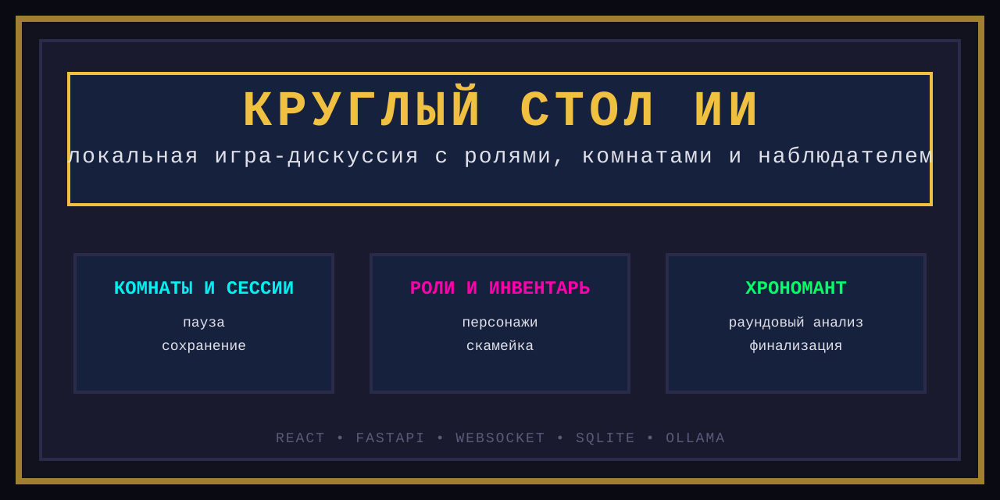

# Релизное описание



## Круглый стол ИИ

`Круглый стол ИИ` — это локальная пиксельная игра-дискуссия, где несколько ИИ-персонажей обсуждают одну тему за виртуальным столом.

Внутри релиза уже есть:
- комнаты и сохранение сессий;
- пауза и продолжение разговора;
- активные участники и скамейка;
- инвентарь сохранённых персонажей;
- профессиональные роли и характеры;
- пользовательский вопрос прямо в живую беседу;
- наблюдатель `Хрономант`, который следит за ходом раундов;
- ручной и полуавтоматический финал разговора.

## Для кого этот релиз

- для мозговых штурмов;
- для сравнения разных профессиональных точек зрения;
- для игровых или полу-ролевых дискуссий;
- для экспериментов с составом ИИ-персонажей;
- для локальной работы через `Ollama`.

## Что нового в текущей версии

- введены комнаты, сессии и раунды;
- добавлено сохранение состояния в `SQLite`;
- появился инвентарь персонажей;
- добавлена скамейка и управление составом во время паузы;
- внедрён `Хрономант`;
- улучшен ритм живого чата;
- устранены дубли сообщений;
- интерфейс и сценарии запуска приведены к русскому стилю;
- добавлено мягкое завершение dev-сеанса.

## Системные требования

- Windows
- Python
- Node.js
- Ollama

## Быстрый старт

```powershell
cd circletable
.\start.bat
```

## Сопроводительные материалы

- [README.md](./README.md) — основной README репозитория
- [README_AI.md](./README_AI.md) — handoff для следующего ИИ/разработчика
- [SESSION_CHANGELOG.md](./SESSION_CHANGELOG.md) — журнал изменений текущей сессии

## Тон проекта

Это не корпоративный инструмент и не сухая панель управления.  
По настроению проект ближе к неоновой пиксельной арене, где у каждого участника есть своё лицо, своя роль и своя манера вести спор.
