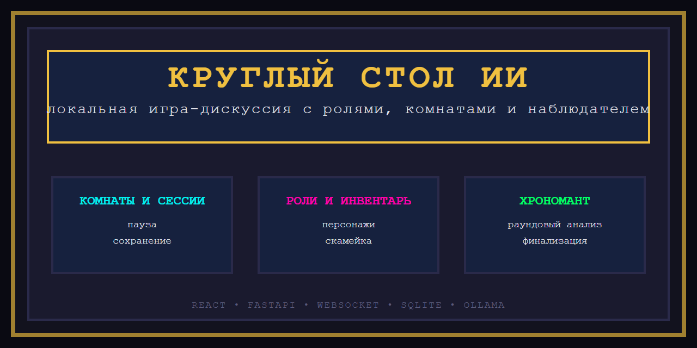

# v0.1.0 — первый релиз

## Что это

`Круглый стол ИИ` — это локальная пиксельная игра-дискуссия, где несколько ИИ-персонажей обсуждают тему за виртуальным столом, спорят, приходят к выводу и оставляют после себя хронику сессии.

## Главное в релизе

- добавлены комнаты, сессии и раунды;
- появилось сохранение состояния в `SQLite`;
- внедрены инвентарь персонажей и скамейка;
- расширены роли, характеры и профессиональные специализации;
- добавлен наблюдатель `Хрономант`;
- появился пользовательский вопрос прямо в живой диалог;
- реализованы пауза, продолжение, финальный раунд и автофинализация;
- проект переведён на быстрый cloud-дефолт для тестов;
- устранены дубли сообщений;
- подготовлены документы handoff и релизные материалы.

## Что внутри уже работает

- круглый стол с несколькими ИИ-участниками;
- управление составом во время паузы;
- сохранённые профили персонажей;
- восстановление незавершённых сессий;
- межраундовая аналитика;
- локальный запуск через `start.bat`;
- мягкое завершение dev-сеанса из интерфейса.

## Для кого

- для мозговых штурмов;
- для игровых или полу-ролевых обсуждений;
- для сравнения профессиональных взглядов;
- для экспериментов с ИИ-командами и составами;
- для локальной работы через `Ollama`.

## Техническая база релиза

- `React`
- `Vite`
- `FastAPI`
- `WebSocket`
- `SQLite`
- `Ollama`

## Статус

Это первый собранный релизный срез проекта.  
Архитектурный фундамент уже заложен: дальше можно наращивать лабораторию персонажей, более глубокую память, карточки развития и расширенный meta-слой.
